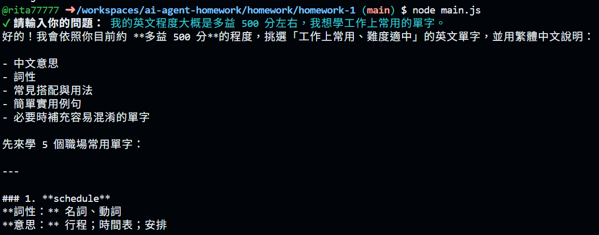
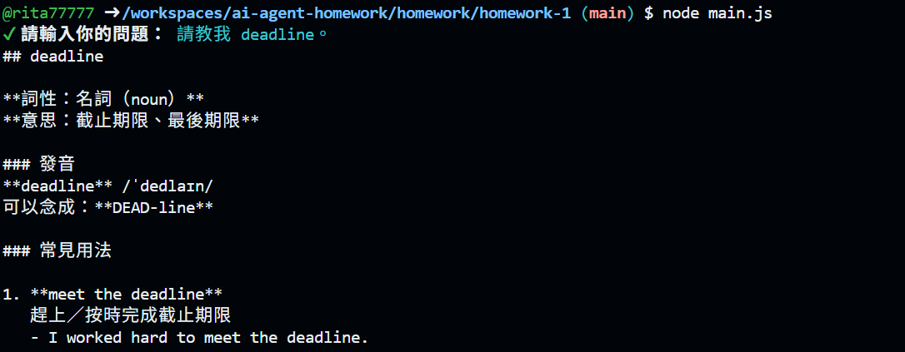
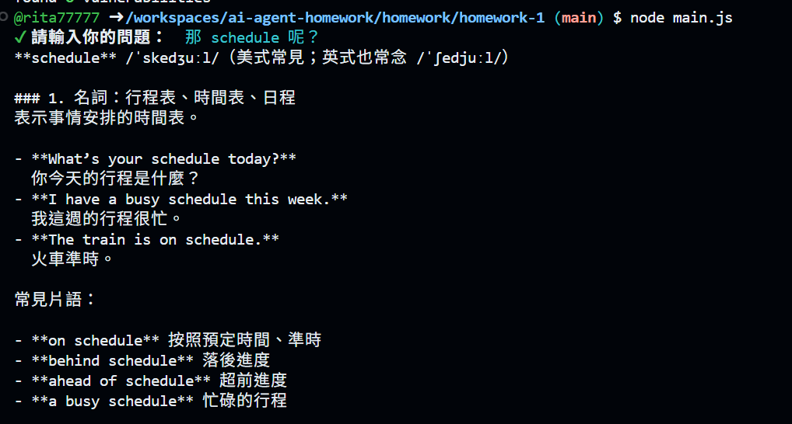
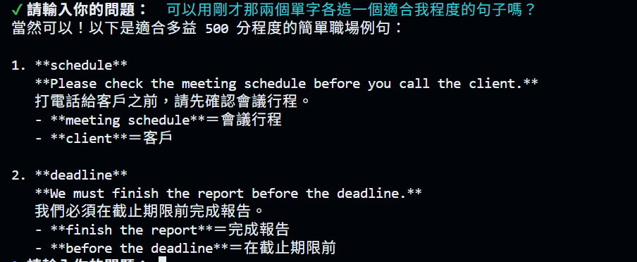
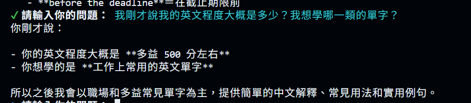

# AI Agent Homework 1

## 作業內容

打造專屬角色聊天機器人：**英文單字小老師**

本作業從 `1.4-openai-api-with-memory` 開始實作，修改 `main.js` 中 `initMessage()` 的系統指令，將 AI 設定為英文單字學習助手。

---

## 角色設定

AI 的角色為「英文單字小老師」，主要協助英文初學者學習單字。

功能包含：

- 使用繁體中文解釋英文單字
- 說明單字意思與詞性
- 提供常見用法
- 提供簡單實用的英文例句
- 根據使用者的英文程度調整回答
- 記住前面對話中提到的學習程度與需求

系統指令包含明確的角色、回答方式與專業領域，並超過 50 字。

---

## 對話記憶測試

本次進行 5 輪以上的連續對話。

測試一開始先告訴 AI：

- 英文程度約為多益 500 分
- 希望學習工作上常用的英文單字

接著詢問 `deadline`、`schedule` 等工作相關單字，並要求 AI 使用前面學過的單字造句。

最後再詢問 AI：

> 我剛才說我的英文程度大概是多少？我想學哪一類的單字？

AI 能正確回答：

- 英文程度約為多益 500 分
- 想學工作上常用的英文單字

表示 AI 能保留並使用前面對話中的資訊。

---

## 實際對話紀錄

### 第 1 輪

### 第 2 輪

### 第 3 輪

### 第 4 輪

### 第 5 輪

---

## 測試結果

本次測試成功完成 5 輪以上的連續對話。

AI 能維持「英文單字小老師」的角色設定，並能記住使用者前面提到的英文程度與學習需求，在後續回答中繼續使用這些資訊。

因此確認：

- 系統角色設定正常
- 多輪對話正常
- 對話記憶功能正常
- 回答內容符合英文單字小老師的角色設定