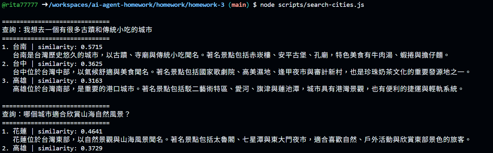
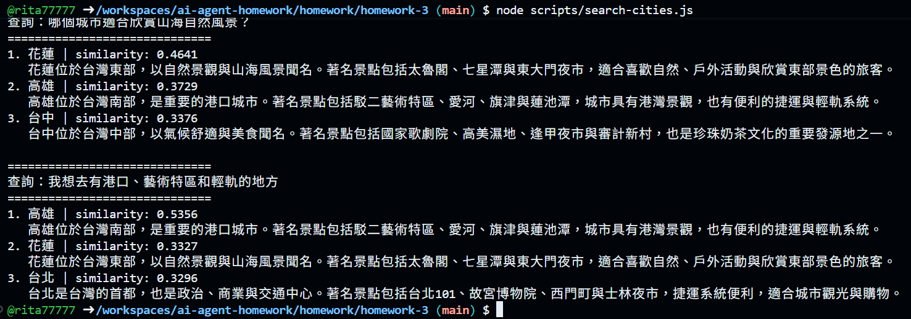

# AI Agent Homework 3

## 作業內容

建立迷你知識庫：**台灣城市介紹**

本作業從 `3.2-rag-search-text` 開始實作，參考課程中的 Netflix 向量搜尋範例，建立自己的台灣城市知識庫，並使用 Qdrant 進行語意搜尋。

---

## 知識庫內容

本次建立 5 筆台灣城市資料：

1. 台北
2. 台中
3. 台南
4. 高雄
5. 花蓮

每筆資料包含：

- 城市名稱
- 城市特色
- 主要景點
- 美食或旅遊資訊

---

## Qdrant Collection

建立新的 Qdrant Collection：

```text
taiwan_cities
```

使用的 Embedding Model：

```text
text-embedding-3-small
```

將城市介紹文字轉換成 Embedding Vector 後，儲存至 `taiwan_cities` Collection。

流程如下：

```text
台灣城市介紹
      ↓
OpenAI Embedding
text-embedding-3-small
      ↓
Embedding Vector
      ↓
Qdrant
      ↓
taiwan_cities Collection
```

---

## 實作內容

### 1. `scripts/embed-cities.js`

負責建立城市知識庫。

主要功能：

- 建立 `taiwan_cities` Collection
- 準備 5 筆台灣城市資料
- 將文字轉換成 Embedding
- 將向量與城市資料寫入 Qdrant

執行：

```bash
node scripts/embed-cities.js
```

執行結果：

```text
已建立 collection: taiwan_cities
成功寫入 5 筆城市資料
```

---

### 2. `lib/qdrant.js`

新增：

```text
TAIWAN_CITIES_COLLECTION
searchCities()
```

`searchCities()` 會先將使用者輸入的問題轉換成 Embedding，再使用 Qdrant 搜尋語意最相近的城市資料。

---

### 3. `scripts/search-cities.js`

使用三種不同的自然語言問題測試知識庫。

執行：

```bash
node scripts/search-cities.js
```

---

## 搜尋測試結果

### 查詢 1

```text
我想去一個有很多古蹟和傳統小吃的城市
```

搜尋結果：

```text
1. 台南 | similarity: 0.5715
2. 台中 | similarity: 0.3625
3. 高雄 | similarity: 0.3163
```

搜尋結果第一名為 **台南**，符合台南具有許多古蹟、寺廟與傳統小吃的資料內容。

---

### 查詢 2

```text
哪個城市適合欣賞山海自然風景？
```

搜尋結果：

```text
1. 花蓮 | similarity: 0.4641
2. 高雄 | similarity: 0.3729
3. 台中 | similarity: 0.3376
```

搜尋結果第一名為 **花蓮**，符合花蓮以自然景觀、山海風景及戶外活動聞名的資料內容。

---

### 查詢 3

```text
我想去有港口、藝術特區和輕軌的地方
```

搜尋結果：

```text
1. 高雄 | similarity: 0.5356
2. 花蓮 | similarity: 0.3327
3. 台北 | similarity: 0.3296
```

搜尋結果第一名為 **高雄**，符合高雄具有港口、駁二藝術特區及輕軌的資料內容。

---

## 實際執行截圖

### 搜尋測試截圖 1

包含古蹟、傳統小吃，以及山海自然風景的搜尋結果。



### 搜尋測試截圖 2

包含山海自然風景，以及港口、藝術特區、輕軌的搜尋結果。



---

## 測試結論

本作業成功建立包含 5 筆城市資料的獨立 Qdrant Collection：

```text
taiwan_cities
```

透過 OpenAI Embedding 與 Qdrant Vector Search，可以使用自然語言描述需求，而不需要直接輸入城市名稱，也能搜尋到語意最相關的結果。

三次測試的第一名結果分別為：

```text
古蹟與傳統小吃 → 台南
山海自然風景 → 花蓮
港口、藝術特區與輕軌 → 高雄
```

三次搜尋結果皆符合預期，表示知識庫建立與語意搜尋功能皆正常運作。