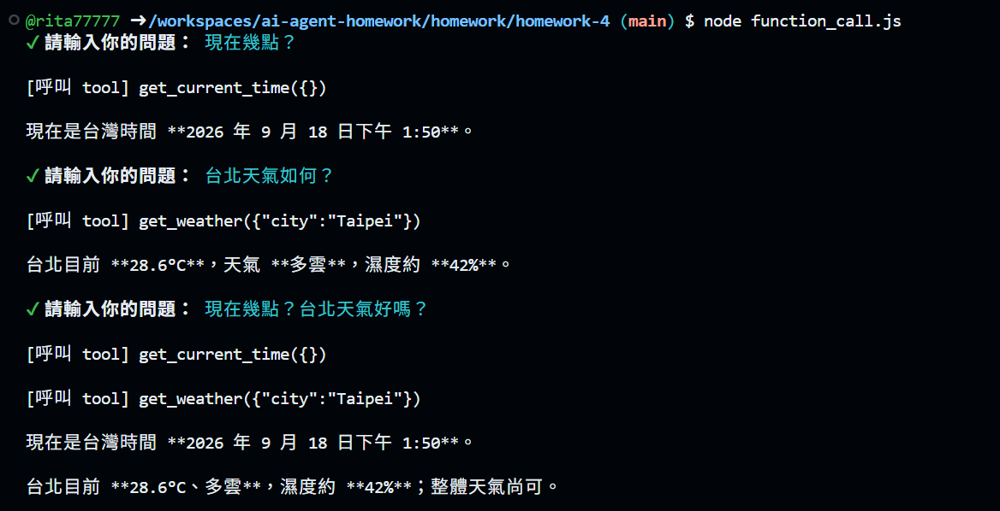

# AI Agent Homework 4

## 作業內容

從 `2.5-tool-calling-current-time` 開始，整合「時間工具」與「天氣工具」。

## 實作內容

- `tools/index.js` 已 export 天氣工具與時間工具
- `function_call.js` 的系統指令已說明 AI 可以查詢時間與天氣
- AI 會依照問題自動選擇正確工具
- 同時詢問時間與天氣時，會呼叫兩個工具並整合回答

## 測試結果

### 1. 現在幾點？

成功呼叫：

```text
get_current_time
```

### 2. 台北天氣如何？

成功呼叫：

```text
get_weather
```

### 3. 現在幾點？台北天氣好嗎？

成功同時呼叫：

```text
get_current_time
get_weather
```

並將兩個工具的結果整合回答。

## 執行截圖

