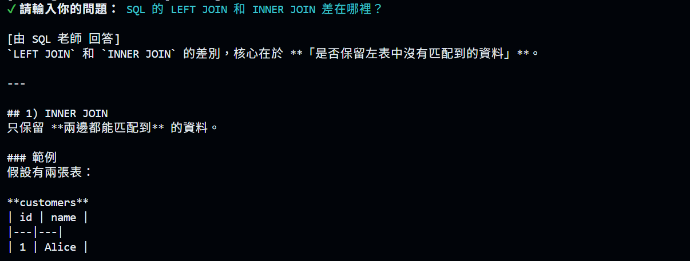
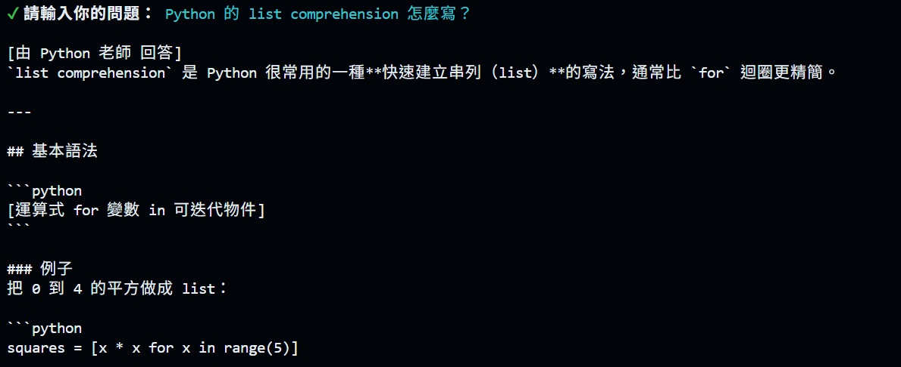

# AI Agent Homework 5

## 作業內容

從 `5.1-agents-md` 開始，在原本 PHP、Vue、Python 老師之外，新增一位 **SQL 老師**。

## 實作內容

- 在 `main.js` 新增 `SQL 老師`
- SQL 老師有自己的 `instructions` 與 `handoffDescription`
- 將 `SQL 老師` 加入班導師的 `handoffs`
- 在 `AGENTS.md` 新增 SQL 相關問題的轉交規則

## 測試結果

### 1. SQL 問題 → SQL 老師

問題：

```text
SQL 的 LEFT JOIN 和 INNER JOIN 差在哪裡？
```

結果：

```text
[由 SQL 老師 回答]
```



---

### 2. Python 問題 → Python 老師

結果：

```text
[由 Python 老師 回答]
```



---

### 3. 一般工具問題 → 班導師

結果：

```text
[由 班導師 回答]
```


## 結果

三種問題皆成功交由正確的 Agent 處理，SQL 老師也不會接收不屬於 SQL 的問題。